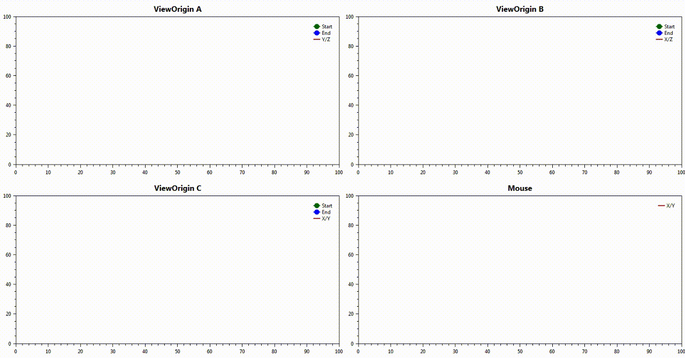

[](https://travis-ci.org/NeKzor/SourceDemoParser.Net)
[](https://github.com/NeKzor/SourceDemoParser.Net/projects/1)
[](https://github.com/NeKzor/SourceDemoParser.Net/releases)

Parse any protocol version 4 Source Engine demo.

## Overview
- [Main Features](#main-features)
- [C# Documentation](#c--documentation)
  - [Namespaces](#namespaces)
  - [Parsing](#parsing)
  - [Extensions](#extensions)
  - [Adjustments](#adjustments)
  - [Custom Adjustments](#custom-adjustments)
    - [ISourceDemo](#isourcedemo)
    - [Discover, Load & Adjust](#discover-load--adjust)
  - [Parse, Edit & Export](#parse-edit--export)
  - [Custom Engine](#custom-engine)
    - [Structure](#structure)
	- [Message Frame](#message-frame)
	- [Demo Message](#demo-message)
	- [Message Type](#message-type)
	- [Configuration](#configuration)
	- [Parser](#parser)
- [Examples](#examples)

## Main Features
- Multiple parsing modes
- Parses almost everything
- Demo header fix
- Adjustment for special demo rules, defined by speedrunning communities

## C# Docs

### Namespaces

| Namespace | Description |
| --- | --- |
| SourceDemoParser | SourceDemo, SourceParser etc. |
| SourceDemoParser.Messages | Default demo messages. |
| SourceDemoParser.Messages.Net | Default networking and server-client messages. |
| SourceDemoParser.Types | Default demo message types. |
| SourceDemoParser.Messages.Net | Default net messages types. |
| SourceDemoParser.Extensions | Useful demo utilities and demo adjusting. |
| SourceDemoParser.Extensions.Demos | Default demo adjustments. |

### Parsing
```cs
using SourceDemoParser;

var parser = new SourceParser
(
  ParsingMode.Everything, // Parse useful information too
  AdjustmentType.Exact // Fix time in header
);

var demo = await parser.ParseFileAsync("rank2.dem");
```

### Extensions
```cs
using SourceDemoParser.Extensions;

var tickrate = demo.GetTickrate();
var tps = demo.GetTicksPerSecond();
```

### Adjustments
```cs
using SourceDemoParser.Extensions;

// Some games and mods (Portal 2 etc.) have issues when ending a demo
// through a changelevel. To fix the incorrect header (PlaybackTime and
// PlaybackTicks) we take the last positive tick of the parsed messages
await demo.AdjustExact();

// Adjusts demo until a special command. Default standard was defined
// by the SourceRuns community (echo #SAVE#)
await demo.AdjustFlagAsync(saveFlag: "echo #IDEEDIT#");

// Adjustments for specific maps with special rules
// Requires frame data to be parsed before: Set mode of parser
// to "Everything" or use
await demo.ParseFrames();

// Also: adjustments have to be loaded first (see below)
await demo.AdjustAsync();
```

### Custom Adjustments

#### ISourceDemo
```cs
using SourceDemoParser.Extensions;

// Implement ISourceDemo
public class Portal2CustomMapDemo : ISourceDemo
{
  // Set demo folder and tickrate
  public string GameDirectory => "portal2";
  public uint DefaultTickrate => 60u;

  // Return boolean for an adjustment
  // Example: Find start tick of a specific map
  [StartAdjustment("sp_gud_mape")]
  public bool SpGudMape_Start(PlayerPosition pos)
  {
    // Search logic with: PlayerPosition
    var destination = new Vector(-723.00f, -2481.00f, 17.00f);
    if ((pos.Previous != destination) && (pos.Current != destination))
      return true;
    return false;
  }
  // Example: Find end tick of a specific map with negative tick offset
  [EndAdjustment("sp_gud_mape_finale", -1)]
  public bool SpGudMapeFinale_Ending(PlayerCommand cmd)
  {
    // Search logic with: PlayerCommand
    var command = "playvideo_exitcommand_nointerrupt at_credits end_movie credits_video";
    return (cmd.Current == command);
  }

  // Example: Find end tick of any map with positive tick offset
  [EndAdjustment(offset: 1)]
  public bool ForSpecialCasesAlwaysCheck_Ending(PlayerCommand cmd)
  {
    var command = "echo SPECIAL_FADEOUT_WITH_VALUE";
    return (cmd.Current.StartsWitch(command));
  }
}
```
##### [More Demo Examples](https://github.com/NeKzor/SourceDemoParser.Net/tree/master/src/SourceDemoParser.Net/Adjustments/Demos)

#### Discover, Load & Adjust
```cs
using SourceDemoParser.Extensions;

// Stuff will be cached automatically on success
// Load all default adjustments
await Adjustments.DiscoverAsync();

// Load all adjustments of an assembly using System.Reflection:
var result = await Adjustments.DiscoverAsync(Assembly.GetEntryAssembly());
if (result) Console.WriteLine("Loaded at least one new adjustment.");

// Or load manually
result = await SourceExtensions.LoadAsync<Portal2CustomMapDemo>();
if (result) Console.WriteLine("Loaded " + nameof(Portal2CustomMapDemo));

// Finally use:
await demo.AdjustAsync();
```

### Parse, Edit & Export
```cs
using SourceDemoParser;
using SourceDemoParser.Extensions;

var exporter = new SourceExporter();
demo.PlaybackTicks = 1337;
demo.PlaybackTime = 420; 
await exporter.ExportFileAsync("h4ck3r.dem");
```

### Custom Engine

#### Structure

| Name | Type | Description |
| --- | --- | --- |
| ExampleParser | SourceParser | New example parser. |
| Example | DemoMessageType | The new message type which should be handled as 0x0A byte. |
| ExampleMessage | DemoMessage | The actual message which handles parsing and exporting functionality. |
| ExampleFrame | IDemoFrame | Message data. |
| ExampleDemoMessages.ExampleEngine | List\<DemoMessageType\> | Default messages of the custom engine containing the new message type. |

#### Message Frame
```cs
public class ExampleFrame : IDemoFrame
{
  public byte[] Data { get; set; }

  // Will be called if parsing mode is
  // set to "Everything"
  Task IDemoFrame.Parse(SourceDemo demo)
  {
    // Parse Data into something readable
    return Task.CompletedTask;
  }
  // For exporting edited data
  Task<byte[]> IDemoFrame.Export(SourceDemo demo)
  {
    // Reverse parsing logic here
    return Task.FromResult(Data);
  }
}
```

#### Demo Message
```cs
public class ExampleDemoMessage : DemoMessage<ExampleFrame>
{
  public override Task Parse(BinaryReader br, SourceDemo demo)
  {
    Data = br.ReadBytes(br.ReadInt32());
    return Task.CompletedTask;
  }
  public override Task Export(BinaryWriter bw, SourceDemo demo)
  {
    bw.Write(Data.Length);
    bw.Write(Data);
    return Task.CompletedTask;
  }
}
```

#### Message Type
```cs
public class Example : DemoMessageType<ExampleDemoMessage>
{
  public Example(int code) : base(code)
  {
  }
}
```

#### Configuration
```cs
public static class ExampleDemoMessages
{
  // Demo message type will be handled by list index
  // Example: code = 0x03 => type = list[code - 1] = SyncTick
  public static List<DemoMessageType> ExampleEngine;

  static ExampleDemoMessages()
  {
    // Note: Message name "Stop" should always be the last
    // message of the demo
    ExampleEngine = DemoMessages.Default;
    // New message handled at 0x0A
    ExampleEngine.Add(new Example(0x0A));
  }
}
```

#### Parser
```cs
public class ExampleParser : SourceParser
{
  // Detect your custom demo here
  public override Task Configure(SourceDemo demo)
  {
    _ = base.Configure(demo);

    switch (demo.GameDirectory)
    {
      case "example_mod":
        // Overwrite default game messages with yours
        demo.Game.DefaultMessages = ExampleDemoMessages.ExampleEngine;
        break;
    }
    return Task.CompletedTask;
  }
}
```

## Examples

### [CLI Tool](https://github.com/NeKzor/SourceDemoParser.Net/tree/master/src/SourceDemoParser-CLI)
Simple tool for command line interfaces.

Example: `dotnet SourceDemoParser-CLI.dll header segment_42.dem`.

### [SourceDemoParser-DS](https://github.com/NeKzor/SourceDemoParser.Net/tree/master/src/SourceDemoParser-DS)
[](https://github.com/NeKzor/SourceDemoParser.Net/tree/master/src/SourceDemoParser-DS)